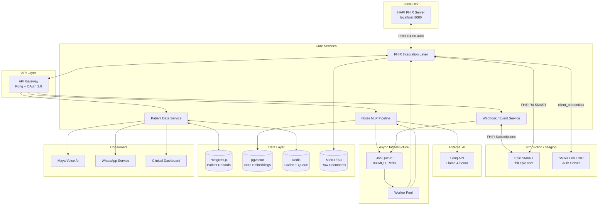
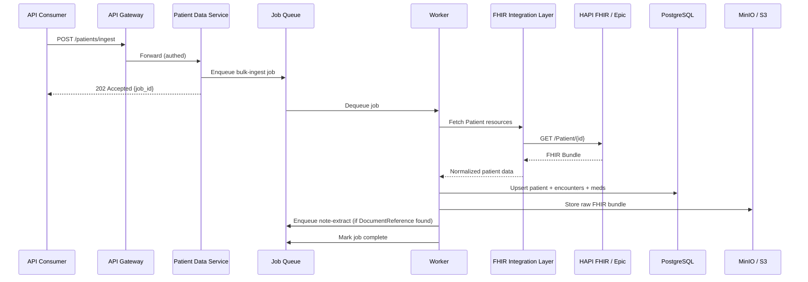
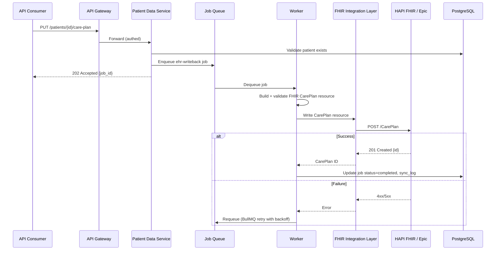
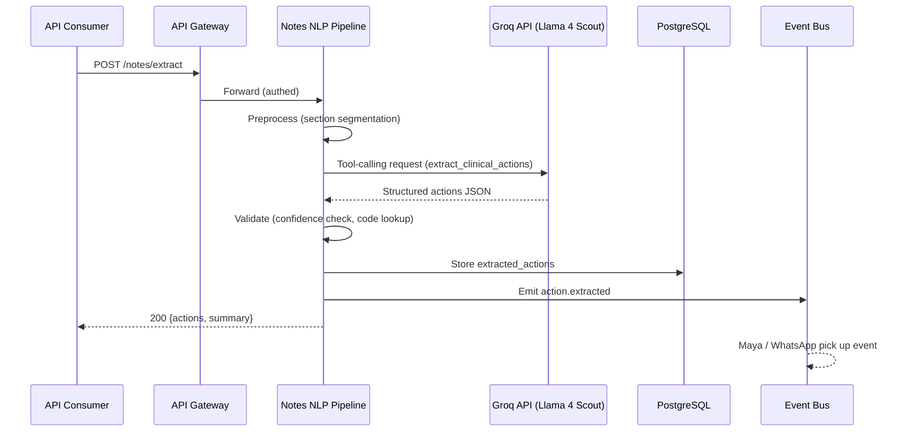

# EHR Integration System — Architecture Design Document

> **Author:** Keshav | **Date:** 2026-05-08 | **Version:** 2.0
> **Context:** 2care.ai assignment — AI-powered post-discharge care platform

> **Implementation status:** Features marked ✓ are fully implemented and demonstrated by `npm run seed:demo`. Features marked _(planned)_ are designed and scaffolded (types, schema, service stubs) but the implementation code does not yet exist.

---

## Table of Contents

1. [System Overview & Goals](#1-system-overview--goals)
2. [Assumptions](#2-assumptions)
3. [Architecture Diagram](#3-architecture-diagram)
4. [Key System Components](#4-key-system-components)
5. [API Contracts](#5-api-contracts)
6. [Data Flow Diagrams](#6-data-flow-diagrams)
7. [AI Backend Architecture](#7-ai-backend-architecture)
8. [Technology Stack & Justification](#8-technology-stack--justification)
9. [Scalability, Security & Compliance](#9-scalability-security--compliance)
10. [Trade-off Analysis](#10-trade-off-analysis)

---

## 1. System Overview & Goals

This system is an EHR integration backend for 2care.ai's post-discharge care platform. It connects to hospital EHR systems via HL7 FHIR R4, enabling three core capabilities:

| Capability | Description |
|---|---|
| **Ingest** | Pull patient demographics, encounters, medications, and clinical documents from EHR systems into a normalized internal store. |
| **Update** | Push record changes (care plan updates, follow-up outcomes, risk flags) back to the source EHR. |
| **Extract Actions** | Process free-text doctor notes through Groq AI (Llama 4 Scout) to extract structured clinical actions (medication changes, follow-up orders, referrals, patient instructions). |

### Alignment with 2care.ai

2care.ai's voice AI agent "Maya" and WhatsApp engagement layer depend on structured clinical data. This system provides the data pipeline that feeds those products — turning unstructured EHR data and doctor notes into actionable care instructions that Maya can deliver to patients post-discharge.

---

## 2. Assumptions

### Regulatory
- The system operates under **HIPAA** requirements (US healthcare).
- All PHI is encrypted at rest (AES-256) and in transit (TLS 1.3).
- Business Associate Agreements (BAAs) are in place with EHR vendors and cloud providers.
- Audit logs are retained for a minimum of 6 years per HIPAA requirements.

### Technical
- Target EHR systems support **FHIR R4** APIs. **Epic** is the primary integration target for v1. Legacy HL7v2 interfaces are out of scope for v1 but accounted for in the design.
- **Local development** uses a self-hosted **HAPI FHIR** server (Docker) — no external EHR dependency needed. Production targets Epic FHIR with SMART on FHIR client credentials flow.
- Authentication to EHR systems uses **SMART on FHIR client credentials flow** (backend services / machine-to-machine). Epic requires **RS384-signed JWT assertions** for client credentials — not a shared `client_secret`.
- The system processes notes in **English** only for v1.
- **Groq API** (model: `meta-llama/llama-4-scout-17b-16e-instruct`) is used for NLP; no self-hosted models in v1.
- Peak load estimate: ~50 hospitals, ~10,000 patient records ingested/day, ~5,000 notes processed/day.
- Local HAPI FHIR server is seeded with 5 synthetic patients. No real PHI in development.

### EHR Constraints
- EHR FHIR APIs have **rate limits** (typically 100-300 req/min per production tenant). Epic sandbox limits to approximately **40 req/min** — the ingest worker respects this with per-tenant throttling.
- Not all EHR systems expose the same FHIR resources; the system handles partial data gracefully.
- EHR webhooks (FHIR Subscriptions) are available at some but not all sites — polling is the fallback.

---

## 3. Architecture Diagram



---

## 4. Key System Components

### 4.1 FHIR Integration Layer

The adapter between internal services and external EHR systems.

**Responsibilities:**
- Authenticate with EHR systems via SMART on FHIR (OAuth 2.0 client credentials or no-auth for local HAPI).
- Read FHIR resources: `Patient`, `Encounter`, `MedicationRequest`, `DocumentReference`, `Condition`, `AllergyIntolerance`, `CarePlan`.
- Write FHIR resources: `CarePlan`, `Task`, `Flag`, `Communication`.
- Normalize FHIR responses into internal data models (handle R4 variations across vendors).
- Respect per-tenant rate limits using a token-bucket rate limiter backed by Redis.

**Design:**
```
FHIRClient (per-tenant config)
├── AuthManager (SMART on FHIR client credentials)
│     Mode A — FHIR_AUTH_TYPE=none (local HAPI FHIR, no auth):
│       getToken() returns null; no Authorization header sent.
│       HAPI FHIR accepts unauthenticated reads AND writes.
│
│     Mode B — FHIR_AUTH_TYPE=smart (Epic fhir.epic.com):
│       1. Build a signed JWT assertion:
│            alg:  RS384  (Epic requires RS384; RS256 is rejected)
│            iss:  client_id  (registered with Epic)
│            sub:  client_id
│            aud:  Epic token endpoint URL
│            jti:  UUID  (mandatory — Epic rejects assertions without it)
│            exp:  now + 5 minutes
│            nbf/iat: now
│       2. POST to Epic token endpoint:
│            grant_type=client_credentials
│            client_assertion_type=urn:ietf:params:oauth:client-assertion-type:jwt-bearer
│            client_assertion=<signed RS384 JWT>
│       3. Cache returned access_token until (exp − 60 s)
│       4. Attach as  Authorization: Bearer <token>  on all FHIR requests
│
│     Auth config is environment-driven:
│       FHIR_AUTH_TYPE=none|smart
│       FHIR_BASE_URL=                     # FHIR R4 base URL
│       FHIR_CLIENT_ID=                    # Epic app client_id (smart only)
│       FHIR_PRIVATE_KEY_PATH=             # path to RS384 private key PEM (smart only)
│       FHIR_TOKEN_URL=                    # Epic OAuth2 token endpoint (smart only)
│
├── ResourceReader (GET + search with pagination)
├── ResourceWriter (PUT/POST with optimistic locking via ETag)
├── RateLimiter (token bucket, Redis-backed)
└── RetryPolicy (exponential backoff, max 3 retries)
```

Each hospital tenant has its own `FHIRClient` instance configured with endpoint URL, credentials, supported resources, and rate limit thresholds.

### 4.2 API Gateway & Auth

**Technology:** Kong (open-source) or AWS API Gateway.

**Responsibilities:**
- Route requests to internal services.
- Authenticate internal consumers (Maya, WhatsApp service, dashboard) via **OAuth 2.0 bearer tokens** (issued by an internal identity provider).
- Rate limiting per consumer.
- Request/response logging (with PHI redaction in logs).
- TLS termination.

**Auth flow:**
1. Internal service requests a token from the identity provider (Keycloak) with appropriate scopes (`patient:read`, `patient:write`, `notes:extract`).
2. Gateway validates the token and forwards the request with tenant context in headers.

> **Local dev:** Keycloak is replaced by a lightweight JWT middleware (`JWT_SECRET` in `.env`). `npm run token` prints a signed dev JWT.

### 4.3 Patient Data Service

The central service for reading and writing normalized patient data.

**Responsibilities:**
- CRUD operations on the internal patient data model.
- Merge logic for data from multiple EHR sources (patient matching by MRN + demographics).
- Serve patient data to downstream consumers (Maya, WhatsApp, Dashboard).
- Cache frequently accessed patient records in Redis (TTL: 5 minutes, invalidated on update).

**Internal Data Model (PostgreSQL):**
```sql
-- Core tables
patients (id, mrn, tenant_id, demographics JSONB, created_at, updated_at)
encounters (id, patient_id, type, period_start, period_end, status, data JSONB)
medications (id, patient_id, encounter_id, name, dosage, status, data JSONB)
conditions (id, patient_id, code, display, onset_date, status)
clinical_documents (id, patient_id, encounter_id, type, raw_text, s3_key, processed_at)
extracted_actions (id, document_id, patient_id, action_type, details JSONB, confidence, status)
sync_log (id, tenant_id, resource_type, direction, status, error, timestamp)
```

### 4.4 Doctor Notes NLP Pipeline

Processes free-text clinical notes through Groq AI (Llama 4 Scout) to extract structured actions.

**Pipeline steps:**
1. **Receive** — note text arrives via API call (`POST /api/v1/notes/extract`) or async job.
2. **Preprocess** — strip formatting artifacts, segment into sections using rule-based heuristics. ✓ implemented
3. **Extract** — send to Groq API with forced tool-calling (`extract_clinical_actions`). ✓ implemented
4. **Validate** — confidence scoring via heuristics; actions below 0.7 flagged for review. ✓ implemented
5. **Store** — persist structured actions to `extracted_actions` table. ✓ implemented
6. **Notify** — emit `action.extracted` event to Redis pub/sub. ✓ published _(consumers not yet implemented)_

> **Planned:** During ingest, `DocumentReference` resources are not yet fetched or queued for extraction. Currently, note extraction is triggered only via direct API call.

**Failure handling:**
- If Groq API is unavailable, returns 502 to caller; async worker retries with exponential backoff.
- If extraction confidence is below 0.7, the action is stored with `status: pending` and flagged for human review.

### 4.5 Async Job Queue

**Technology:** BullMQ (Node.js) backed by Redis.

**Job types:**
| Job | Trigger | Concurrency | Retry |
|---|---|---|---|
| `bulk-ingest` | Scheduled (nightly) or on-demand | 5 per tenant | 3x, exponential |
| `note-extract` | New document ingested | 10 global | 5x, exponential |
| `ehr-writeback` | Action approved by clinician | 3 per tenant | 3x, exponential |
| `sync-poll` | Cron (every 15 min per tenant) | 1 per tenant | 1x |

**Why BullMQ over SQS/Kafka:**
- BullMQ provides per-job concurrency controls, priority queues, and rate limiting out of the box.
- Redis is already in the stack for caching.
- For v1 scale (~10K records/day), BullMQ is sufficient. Migration path to Kafka exists if event volume exceeds 100K/day.

### 4.6 Data Store

| Store | Purpose | Justification |
|---|---|---|
| **PostgreSQL 16** | Patient records, encounters, medications, actions, audit logs | ACID compliance for healthcare data; JSONB for semi-structured FHIR data; mature ecosystem. |
| **pgvector** (PG extension) | Note embeddings for semantic search | Avoids a separate vector DB; co-located with relational data; sufficient for v1 scale. |
| **Redis 7** | Cache (patient lookups), job queue (BullMQ), rate limiter state | Low-latency reads; BullMQ dependency; ephemeral data only (no PHI persisted in Redis beyond cache TTL). |
| **MinIO (local) / S3 (prod)** | Raw clinical documents, FHIR bundle snapshots | Cost-effective blob storage; versioning for audit trail; server-side encryption. |

### 4.7 Webhook / Event System

Handles real-time EHR synchronization and internal event distribution.

**Inbound (EHR to us):**
- Webhook endpoint (`POST /webhooks/fhir`) receives FHIR subscription notifications, validates HMAC signatures, extracts patient references, and enqueues bulk-ingest jobs. ✓ implemented
- _(Planned)_ Automatic registration of FHIR Subscriptions on EHR systems at tenant onboarding — not yet implemented.
- _(Planned)_ Cron-based polling fallback for EHRs without subscription support — not yet implemented.

**Internal events (us to consumers):**
- Redis Pub/Sub channels: `patient.ingested`, `action.extracted` — events are published by the ingest and extract workers. ✓ published
- _(Planned)_ Actual subscribers (Maya, WhatsApp service, dashboard) are not yet implemented. Events are emitted but nothing consumes them.

---

## 5. API Contracts

### 5.1 Ingest Patient Data

```
POST /api/v1/patients/ingest
Authorization: Bearer <token>
Content-Type: application/json

{
  "tenant_id": "hospital-abc",
  "patient_ids": ["patient-camila", "patient-theodore"],  // optional; omit for full sync
  "resources": ["Patient", "Encounter", "MedicationRequest", "DocumentReference"]
}

Response 202 Accepted:
{
  "job_id": "job-uuid-1234",
  "status": "queued",
  "estimated_records": 2,
  "status_url": "/api/v1/jobs/job-uuid-1234"
}
```

### 5.2 Get Patient Record

```
GET /api/v1/patients/{patient_id}?include=encounters,medications,conditions
Authorization: Bearer <token>

Response 200:
{
  "id": "internal-uuid",
  "mrn": "mrn-12345",
  "tenant_id": "hospital-abc",
  "demographics": {
    "name": "Theodore Franklin",
    "dob": "1953-01-01",
    "gender": "male"
  },
  "encounters": [...],
  "medications": [...],
  "conditions": [...]
}
// X-Cache: MISS on first request, HIT on subsequent (5-min TTL)
```

### 5.3 Update Patient Record (Writeback to EHR)

```
PUT /api/v1/patients/{patient_id}/care-plan
Authorization: Bearer <token>
Content-Type: application/json

{
  "encounter_id": "enc-uuid",
  "updates": [
    {
      "type": "CarePlan",
      "action": "add",
      "data": {
        "title": "Post-discharge follow-up",
        "activities": [
          {"detail": "Follow up with cardiologist within 7 days"},
          {"detail": "Daily weight monitoring"}
        ]
      }
    }
  ]
}

Response 202 Accepted:
{
  "job_id": "job-uuid-5678",
  "status": "queued"
}
// Job completes with status: "completed" and FHIR CarePlan ID returned
```

### 5.4 Extract Actions from Doctor Notes

```
POST /api/v1/notes/extract
Authorization: Bearer <token>
Content-Type: application/json

{
  "patient_id": "internal-uuid",
  "encounter_id": "enc-uuid",
  "note_text": "Patient is a 72yo male with CHF exacerbation. Discharge on Lasix 40mg BID, up from 20mg. Follow up with cardiology in 5-7 days. If weight increases >3lbs in 24hrs, call clinic. Refer to cardiac rehab.",
  "note_type": "discharge_summary"
}

Response 200:
{
  "extraction_id": "ext-uuid",
  "patient_id": "internal-uuid",
  "actions": [
    {
      "type": "medication_change",
      "details": { "medication_name": "Furosemide (Lasix)", "previous_dosage": "20mg BID", "new_dosage": "40mg BID" },
      "verbatim_source": "Furosemide (Lasix) 40mg BID - INCREASED from 20mg BID",
      "urgency": "routine",
      "confidence": 0.95
    },
    {
      "type": "follow_up",
      "details": { "specialty": "cardiology", "timeframe": "5-7 days" },
      "verbatim_source": "follow up with cardiology clinic within 5-7 days of discharge",
      "urgency": "routine",
      "confidence": 0.97
    },
    {
      "type": "patient_instruction",
      "details": { "instruction_text": "If weight increases more than 3 pounds in 24 hours, call clinic" },
      "verbatim_source": "If weight increases more than 3 pounds in 24 hours, call the clinic immediately",
      "urgency": "conditional",
      "confidence": 0.93
    },
    {
      "type": "referral",
      "details": { "service": "cardiac rehabilitation" },
      "verbatim_source": "Refer to outpatient cardiac rehabilitation program",
      "urgency": "routine",
      "confidence": 0.96
    }
  ],
  "summary": "Discharge for CHF exacerbation with Lasix dose increase, cardiology follow-up, weight monitoring instructions, and cardiac rehab referral."
}
```

### 5.5 Job Status

```
GET /api/v1/jobs/{job_id}
Authorization: Bearer <token>

Response 200:
{
  "job_id": "job-uuid-1234",
  "type": "bulk-ingest",
  "status": "completed",      // queued | processing | completed | failed | skipped
  "progress": {"total": 5, "completed": 5, "failed": 0},
  "created_at": "2026-05-08T10:00:00Z",
  "completed_at": "2026-05-08T10:02:34Z",
  "errors": []
}
```

---

## 6. Data Flow Diagrams

### 6.1 Patient Data Ingestion



### 6.2 EHR Record Update (Writeback)



### 6.3 Clinical Action Extraction



---

## 7. AI Backend Architecture

### Groq Tool-Calling for Structured Extraction

The system uses Groq's **tool use** (OpenAI-compatible function calling) capability to get structured output rather than parsing free text. Model: `meta-llama/llama-4-scout-17b-16e-instruct`.

**Tool definition sent to Groq:**

```json
{
  "type": "function",
  "function": {
    "name": "extract_clinical_actions",
    "description": "Extract structured clinical actions from a doctor's note. Call this tool with ALL identified actions. Only extract actions explicitly stated in the note.",
    "parameters": {
      "type": "object",
      "properties": {
        "actions": {
          "type": "array",
          "items": {
            "type": "object",
            "properties": {
              "type": {
                "type": "string",
                "description": "Category of clinical action. Use one of: medication_change, new_medication, discontinue_medication, follow_up, referral, lab_order, imaging_order, patient_instruction, dietary_restriction, activity_restriction"
              },
              "details": {
                "type": "object",
                "description": "Type-specific details (medication name, dosage, specialty, timeframe, etc.)"
              },
              "verbatim_source": {
                "type": "string",
                "description": "The exact text from the note that supports this action"
              },
              "urgency": {
                "type": "string",
                "description": "Clinical urgency: routine, urgent, stat, or conditional"
              }
            },
            "required": ["type", "details", "verbatim_source", "urgency"]
          }
        },
        "summary": {
          "type": "string",
          "description": "One-sentence clinical summary of the note"
        }
      },
      "required": ["actions", "summary"]
    }
  }
}
```

> **Note on schema design:** `type` and `urgency` fields use descriptions rather than `enum` arrays. Groq strictly validates tool call responses against JSON schema enums and returns a 400 error if the model produces a value outside the enum (e.g., `medication_continue`). Using descriptions instead of enums preserves flexibility while providing guidance to the model.

### Prompt Design

```
System prompt:
You are a clinical NLP assistant that extracts structured actions from doctor's
notes for a post-discharge care platform. You MUST call the
extract_clinical_actions tool with ALL identified clinical actions.
Be precise — only extract actions explicitly stated in the note. Do not infer
actions not written. Include the exact source text for each action.

User message:
Note type: {note_type}
Patient context: {age}yo {gender}, conditions: {primary_conditions}
---
{preprocessed_note_text}
```

**Design choices:**
- **Tool calling over free-text parsing**: Guarantees structured JSON output; eliminates regex/parsing fragility.
- **Forced tool choice**: `tool_choice: { type: 'function', function: { name: 'extract_clinical_actions' } }` forces the model to always call the tool, eliminating the free-text response path entirely.
- **`verbatim_source` field**: Enables traceability — every extracted action links back to the source text, supporting clinical audit.
- **Patient context in prompt**: Providing age, gender, and conditions helps the model resolve ambiguous references (e.g., "continue current regimen").

### Confidence Scoring

Groq/Llama does not natively output calibrated confidence scores. The system approximates confidence post-extraction via heuristics:

1. **High (0.9+)**: Action has a clear `verbatim_source` match with sufficient detail.
2. **Medium (0.7–0.9)**: Action extracted but details are ambiguous (e.g., "follow up soon" without specific timeframe).
3. **Low (<0.7)**: Action partially inferred or source text is unclear. Flagged for human review (stored with `status: pending`).

This is computed post-extraction by the validation layer (`ActionValidator.ts`), not by the model.

### Embedding Generation _(planned)_

For semantic search across notes (e.g., "find all notes mentioning cardiac rehab referrals"):
- Generate embeddings using a lightweight model and store in PostgreSQL via `pgvector`.
- Query with cosine similarity for retrieval-augmented workflows.

> **Not yet implemented.** The `note_embeddings` table and `ivfflat` index exist in the schema, but no code generates or stores embeddings. No semantic search endpoint exists.

---

## 8. Technology Stack & Justification

| Layer | Technology | Why |
|---|---|---|
| **Runtime** | Node.js 22 (TypeScript) | Async I/O matches the integration-heavy workload; strong FHIR library ecosystem; team familiarity at 2care.ai. |
| **API Framework** | Fastify 5 | Lower overhead than Express; schema-based validation with JSON Schema; built-in logging. |
| **API Gateway** | Kong (OSS) | Plugin ecosystem (OAuth, rate limiting, logging); self-hostable for HIPAA; avoids vendor lock-in. |
| **Identity** | Keycloak (prod) / JWT middleware (local) | Open-source OAuth 2.0 / OIDC provider; SMART on FHIR profile support; fine-grained scopes. |
| **Database** | PostgreSQL 16 + pgvector | JSONB for semi-structured FHIR data; pgvector eliminates need for a separate vector DB; row-level security for tenant isolation. |
| **Cache / Queue** | Redis 7 + BullMQ | BullMQ provides job priorities, rate limiting, and concurrency control; Redis serves double duty as cache. |
| **Object Storage** | MinIO (local) / AWS S3 (prod) | Raw document storage; versioned for audit; SSE-S3 encryption; lifecycle policies for retention. |
| **AI** | Groq API — `meta-llama/llama-4-scout-17b-16e-instruct` | OpenAI-compatible function calling; very fast inference; strong clinical text comprehension. |
| **Local FHIR** | HAPI FHIR (Docker) | Full FHIR R4 compliance; no auth required locally; supports both reads and writes for end-to-end demo. |
| **Infrastructure** | AWS (ECS Fargate) | HIPAA-eligible services; no server management; auto-scaling per service. |
| **Observability** | OpenTelemetry + Grafana | Vendor-neutral tracing; Grafana for dashboards and alerting. |
| **CI/CD** | GitHub Actions | Integrated with code repository; SAST scanning via Semgrep. |
| **SMART on FHIR** | Epic client credentials (RS384 JWT assertion) | Required by Epic for backend service (machine-to-machine) access; standard across major EHRs for server-side integrations. |

---

## 9. Scalability, Security & Compliance

### Scalability

| Concern | Strategy |
|---|---|
| **Horizontal scaling** | Each service (PDS, NLP pipeline, FHIR layer) runs as independent ECS tasks; scale based on queue depth and CPU. |
| **Database scaling** | Read replicas for patient lookups; connection pooling via PgBouncer; partitioning `sync_log` and `extracted_actions` by `tenant_id` and month. |
| **EHR rate limits** | Per-tenant token-bucket rate limiter in Redis; job queue concurrency capped per tenant. |
| **Groq API throughput** | Parallel requests capped at 10; retry with backoff on 429s; batch notes in off-peak hours. |
| **Multi-tenancy** | Tenant isolation via `tenant_id` column + PostgreSQL Row-Level Security policies. Shared infrastructure, logically isolated data. |

### Security

| Control | Implementation |
|---|---|
| **Encryption at rest** | PostgreSQL: TDE or AWS RDS encryption (AES-256). S3: SSE-S3. Redis: encrypted EBS volume. |
| **Encryption in transit** | TLS 1.3 everywhere. Internal service mesh via mTLS (AWS App Mesh or Linkerd). |
| **Authentication** | OAuth 2.0 tokens (Keycloak) for internal services. SMART on FHIR for EHR access. |
| **Authorization** | Scope-based access control (`patient:read`, `patient:write`, `notes:extract`). Tenant-scoped tokens. |
| **PHI in logs** | _(Planned)_ Structured logging via Winston; field-level PHI redaction (names, MRNs, DOBs) not yet implemented. |
| **Secrets management** | AWS Secrets Manager for EHR credentials, API keys. Rotated every 90 days. |
| **Vulnerability scanning** | Semgrep in CI; Dependabot for dependency updates; container scanning via Trivy. |

### HIPAA Compliance

| Requirement | How We Meet It |
|---|---|
| **Access controls** (§164.312(a)) | Role-based access via Keycloak; MFA for admin access. |
| **Audit controls** (§164.312(b)) | `sync_log` table records all EHR reads/writes. API gateway logs all requests. Immutable audit trail in S3. |
| **Integrity controls** (§164.312(c)) | ETag-based optimistic concurrency for EHR writes. Database constraints and validation. |
| **Transmission security** (§164.312(e)) | TLS 1.3 for all connections. |
| **BAA** | Required with AWS, Groq, and any sub-processor handling PHI. |

### HL7 FHIR R4 Compliance

- All external data exchange uses FHIR R4 resource formats.
- FHIR search parameters follow the spec (`_lastUpdated`, `_include`, `_revinclude`).
- Capability statement (`/metadata`) checked on tenant onboarding to discover supported resources.
- FHIR validation using schema validation before writeback.

---

## 10. Trade-off Analysis

### Why This Architecture Over Alternatives

| Decision | Chosen | Alternative | Reasoning |
|---|---|---|---|
| **FHIR-first integration** | HL7 FHIR R4 | Direct database access / HL7v2 | FHIR is the industry direction; Epic/Cerner mandate it. HL7v2 can be added later as an adapter. Direct DB access is a non-starter for security and portability. |
| **Async job queue (BullMQ)** | BullMQ + Redis | Kafka / AWS SQS | BullMQ provides job-level concurrency control and priority queues needed for per-tenant rate limiting. Kafka is overkill at v1 scale. SQS lacks fine-grained concurrency controls. Clear migration path to Kafka if needed. |
| **PostgreSQL + pgvector** | Single DB with extension | PostgreSQL + Pinecone/Weaviate | Fewer moving parts; co-located data reduces latency for joined queries (actions + embeddings); pgvector handles v1 scale (~millions of embeddings). Separate vector DB warranted only at much larger scale. |
| **Groq tool-calling** | Structured tool output | Prompt + regex parsing / fine-tuned model | Tool-calling guarantees schema-compliant JSON; no parsing fragility. Fine-tuned models require training data we don't have yet and add operational complexity. |
| **Groq over self-hosted model** | Groq API | Ollama / vLLM | Groq provides extremely fast inference with no infrastructure overhead. Self-hosted models require GPU provisioning and add operational burden. |
| **Monorepo, separate services** | Service-oriented (not microservices) | Monolith / full microservices | Services share a repo and deploy independently, but aren't over-decomposed. A monolith is too rigid for independent scaling. Full microservices add premature operational overhead. |
| **HAPI FHIR locally** | Local HAPI FHIR container | Epic open sandbox | Epic `open.epic.com` is no longer accessible (404s); `fhir.epic.com` requires OAuth for all reads. HAPI FHIR provides full FHIR R4 compliance, no auth, and supports writes — ideal for local dev and demo. |
| **Kong API Gateway** | Self-hosted Kong | AWS API Gateway / Apigee | Kong is self-hosted (HIPAA control), extensible, and avoids vendor lock-in. AWS API Gateway is viable but less customizable for FHIR-specific middleware. |
| **Keycloak for identity** | Self-hosted Keycloak | Auth0 / Okta | Keycloak supports SMART on FHIR profiles natively; self-hosted for PHI-adjacent data; no per-user pricing. |
| **ECS Fargate** | Serverless containers | EKS / EC2 / Lambda | Fargate avoids cluster management (EKS) and server patching (EC2). Lambda's cold starts and 15-min timeout don't suit long-running ingestion jobs. |

### Known Limitations (v1)

- **No HL7v2 support** — hospitals on legacy interfaces need a separate adapter (planned for v2).
- **English only** — multilingual note extraction requires prompt engineering and validation changes.
- **No real-time streaming** — notes are processed in request-response or async batch; sub-second extraction not supported.
- **Single-region deployment** — multi-region DR is a v2 concern; RPO/RTO targets not yet defined.

---

## Appendix: Repository Structure

```
ehr/
├── packages/
│   ├── fhir-client/          # FHIR integration layer (AuthManager, ResourceReader/Writer)
│   ├── patient-service/      # Patient Data Service (Fastify, port 3001)
│   ├── nlp-pipeline/         # Doctor Notes NLP Pipeline (Fastify, port 3002)
│   ├── job-worker/           # BullMQ workers (ingest, note-extract, writeback)
│   ├── webhook-service/      # Inbound webhooks + event bus (Fastify, port 3003)
│   └── shared/               # Shared types, DB client, Redis, JWT, logger
├── infra/
│   ├── Dockerfile.patient-service
│   ├── Dockerfile.nlp-pipeline
│   ├── Dockerfile.webhook-service
│   └── Dockerfile.job-worker
├── scripts/
│   ├── seed/
│   │   ├── epic-patients.ts  # Local HAPI patient ID constants
│   │   └── seed-hapi.ts      # Seeds HAPI FHIR with synthetic patients
│   └── demo/
│       └── demo-flow.ts      # End-to-end demo runner
├── docker-compose.yml        # 7 services: postgres, redis, minio, hapi-fhir, 3 app services + job-worker
├── ARCHITECTURE.md           # This document
├── PLAN.md                   # Implementation plan
└── README.md
```

## Appendix: Local Development Setup

```bash
# 1. Configure environment
cp .env.example .env
# Set GROQ_API_KEY=gsk_...

# 2. Start all infrastructure + services
docker compose up -d

# 3. Install dependencies
npm install

# 4. Seed HAPI FHIR with synthetic patients
npm run seed:fhir

# 5. Run end-to-end demo
npm run seed:demo
```

**Docker services:**

| Service | Port | Description |
|---|---|---|
| `hapi-fhir` | 8080 | Local FHIR R4 server (hapiproject/hapi) |
| `postgres` | 5432 | PostgreSQL 16 + pgvector |
| `redis` | 6379 | Redis 7 |
| `minio` | 9000/9001 | Object storage (console on 9001) |
| `patient-service` | 3001 | REST API |
| `nlp-pipeline` | 3002 | NLP extraction |
| `webhook-service` | 3003 | Webhooks |
| `job-worker` | — | Background worker (no HTTP port) |
